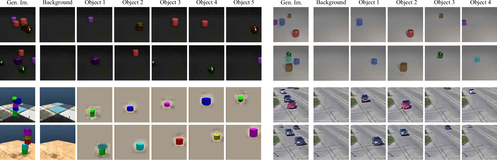

# RELATE: Physically Plausible Multi-Object Scene Synthesis Using Structured Latent Spaces

This repository contains the official implementation of

**[RELATE: Physically Plausible Multi-Object Scene Synthesis Using Structured Latent Spaces](https://arxiv.org/abs/2007.01272)**

It provides the training and evaluation scripts as well as the datasets to reproduce results of the paper.



## Installation
The dependencies of this codebase are managed via [conda](https://docs.conda.io/projects/conda/en/latest/user-guide/install/download.html):
```bash
# build environment
conda env create -f environment.yml
# activate environment
conda activate relate
# install the torch libraries for your CUDA version
pip install torch==1.4.0+cu92 torchvision==0.5.0+cu92 -f https://download.pytorch.org/whl/torch_stable.html
```
The command above requires CUDA 9.2.
If you have a different version of CUDA installed, please visit https://download.pytorch.org/whl/torch_stable.html to find your appropriate package.
You can also use CPU, the code runs with it but we never tested complete training with it. All modeled trained with GPU are compatible to run on CPU.

Tested configurations:

- Ubuntu 16/18.04: torch==1.4.0+cu92 torchvision==0.5.0+cu92
- Ubuntu 16/18.04: torch==1.4.0+cu100 torchvision==0.5.0+cu100
- Ubuntu 16/18.04 (CPU): torch==1.4.0 torchvision==0.5.0

## Dataset
RELATE has been trained and evaluated on the following datasets:

- [CLEVR](https://cs.stanford.edu/people/jcjohns/clevr/)
- [CLEVR5](https://www.dropbox.com/s/upweooedy0wpx89/clevr5.zip?dl=0)
- [CLEVR5-vbg](https://www.dropbox.com/s/w5lze0nvgr314p1/clevr5_vbg.zip?dl=0)
- [ShapeStacks](https://shapestacks.robots.ox.ac.uk/), [Shapestacks test](https://www.dropbox.com/s/39rwcsfi3lzdr5i/shapestacks.zip?dl=0)
- [RealTraffic](https://www.dropbox.com/s/n71t0ln6i43ruuo/cars_real_traffic.zip?dl=0), [RealTraffic test](https://www.dropbox.com/s/5v2nyruppc2jsbe/real_traffic.zip?dl=0)

In order to use them, just download the datasets and unpack them under `data/${DATASET_NAME}` where `DATASET_NAME` is one of the following: `CLEVR_v1.0`, `CLEVR5`, `CLEVR5_vbg`, `shapestacks`, `cars_real_traffic`.
The locations of the datasets can also be changed in the experiment config files located under [`configs/`](configs).
All dataloaders for the respective datasets can be found under [`dataset/`](dataset).
All test sets are provided by default for all CLEVR under a folder named `test/`. We provide custom test sets for Shapestacks and RealTraffic in addition. This will be useful to compute FID score.

## Training
Experiment configurations to train the model on the different datasets can be found under `configs/`.
The most important parameters in each config file are:

- `data_root`: the location of the dataset to train on, defaults to `data/${DATASET_NAME}`
- `exp_dir`: the location of the training output where logs and model snapshots will be stored, defaults to `experiments/${DATASET_NAME}-${PARAMS}`

Here is a simple command to train RELATE on CLEVR5:
```bash
user@host:~$ conda activate relate
(relate) user@host:~$ python main.py --config_file configs/clevr5-train.json
```

As provided the code takes about 8 hours to train on a single Volta V-100 GPU.
By default we don't use gradient penalty, if you wish to do so you can train your model by adding `loss_gradient` as defined in `shapestacks-grad_pen-train.json` or `clevr-256-train.json`. 
It results in longer training time but generally produce better visual results without background failure modes and enable training for larger 256x256 images (see `clevr-256-train.json`).

This code also supports visdom visualisation.
We use `localhost` and default port `8097` for visualisation.
These parameters can be changed (see l.304-305 in `main.py`). 
To visualise the training results and curves, simply run `python -m visdom.server` where you launch your code (if you are using the default localhost; otherwise run it at the address you defined).

By default we use scale augmented model in this repository which you can find on the arXiv version of the paper. To turn off scale augmentation, replace all occurences of `z0=z[0]` by `z0=None`.

## Evaluation/Generation

Pre-trained models for each configuration are available at [this link](https://www.dropbox.com/sh/8sbjug8gds9php9/AACa_fJfeJjaMwUOD67Gi68Ba?dl=0). These models were retrained with the provided code hence it is possible that the FID numbers differ slightly with the one in the paper.


### Evaluation of Static Image Samples (FID)
1) Add `eval_only: True` to the parameters of the json file (see `configs/clevr5-eval.json` for an example). Then run the following command to sample 10k images and save them in the `images/` subdirectory of `exp_dir`:
```bash
(relate) user@host:~$ python main.py --congif_file configs/clevr5-eval.json
```
2) We use a popular [pytorch implementation](https://github.com/mseitzer/pytorch-fid) of the Frechet Inception Distance (FID) which is installed within this repository's conda environment. It is used in the following way:
```bash
(relate) user@host:~$ python -m pytorch_fid path/to/sampled_images_from_model path/to/test_images_from_dataset
```

For convenience, we provide a script to resize the all the images to any desired size in [`tools/resize.py`](tools/resize.py).

### Generation of Video Samples
In order to generate video samples, you can use the following experiment config as an example: `configs/cars_real_traffic-video-eval.json`. This will sample 500 videos from a temporal RELATE model and save them as GIFs.


## Citation
If you use this work for your research please consider citing us:
```
@inproceedings{relate2020,
  title={RELATE: Physically Plausible Multi-Object Scene Synthesis Using Structured Latent Spaces},
  author={Ehrhardt, {S\'ebastien} and Groth, Oliver and Monszpart, Aron and Engelcke, Martin and Posner, Ingmar and {J. Mitra}, Niloy and Vedaldi, Andrea},  
  booktitle={Advances in Neural Information Processing Systems (NeurIPS)},
  year={2020}
}
```

## Acknowledgements 
This work is supported by the European Research Council under grants ERC 638009-IDIU, ERC 677195-IDIU, and ERC 335373. The authors acknowledge the use of Hartree Centre resources in this work. The STFC Hartree Centre is a research collaboratory in association with IBM providing High Performance Computing platforms funded by the UK’s investment in e-Infrastructure. The authors also acknowledge the use of the University of Oxford Advanced Research Computing (ARC) facility in carrying out this work ([http://dx.doi.org/10.5281/zenodo.22558](http://dx.doi.org/10.5281/zenodo.22558)). We also thank Olivia Wiles for feedback on the paper draft and Thu Nguyen-Phuoc for providing the implementation of BlockGAN. 

This code borrows functions from [https://github.com/facebookresearch/c3dpo_nrsfm](https://github.com/facebookresearch/c3dpo_nrsfm) and [https://github.com/edenton/svg](https://github.com/edenton/svg). We thank the authors of both repositories for sharing their code and have copied the respective licenses where applicable.